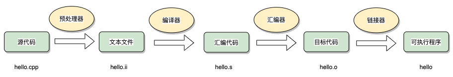

# How Does CPP Work

我们用`helloworld.cpp` 中的内容作为一个例子：

```cpp
#include <iostream>  // preprocessor statement

using namespace std;

int main() {
    std::cout << "Hello World!" << std::endl;
    exit(0);
}
```

首先我们有`#include <iostream>`语句，这是一条预处理指令。在CPP中，任何以#开头的都是预处理指令。当编译器收到源文件时，它所作的第一件事就是处理所有的预处理指令。这也是为什么它们被称作预处理指令，因为它们发生在真正的编译之前。

在这里，我们会找一个名为`iostream`的文件，并将文件中的所有内容复制粘贴到目前这个文件中。这些文件通常被称为头文件。

这个文件会为我们定义一个名为`cout`的函数，它使我们可以打印东西到控制台。

```cpp
int main() {
    std::cout << "Hello World!" << std::endl;
    exit(0);
}
```

这是主函数，每个CPP程序都有这样一个函数，他被称为函数的入口。也就是说，当我们要运行我们的程序时，计算机会从这里开始。在这里，计算机会一行行的执行其中的指令。函数调用或者控制流语句会更改执行的流程，但总体而言，程序是被一行一行执行的。

在这里，第一个要执行的指令就是在控制台输出"Hello World!"。在那之后，程序退出。主函数的声明里定义了函数的返回类型（int），但作为一个特殊的函数，它其实可以不需要返回。

>Not too bad, right?

接下来，我们来细致的解释一下输出"Hello World!"的这行代码。

```cpp
std::cout << "Hello World!" << std::endl;
```

`<<` 这一符号其实是被重载的符号，我们可以将其想象成一个函数，换句话说，这句代码也可以被写成这样：

```cpp
std::cout.print("Hello World!").print(std::endl); // 结尾的endl是一个换行符号
```

> 也不算很细致

## Compile CPP File

所有的CPP文件都会被编译，但头文件不会，头文件中的内容会被复制到CPP文件中，然后被编译。

在这份代码中，我们使用make作为工具帮助我们进行编译。

```makefile
make
```

这一命令会编译helloworld.cpp文件，并产生可执行文件。运行这个编译好的文件，即可看到预期输出。

# How Does CPP Compiler Work

通常我们在进行C++开发时，编译的过程主要包含下面四个步骤：



预处理器：宏定义替换，头文件展开，条件编译展开，删除注释。
- gcc -E选项可以得到预处理后的结果，扩展名为.i 或 .ii。
- C/C++预处理不做任何语法检查，不仅是因为它不具备语法检查功能，也因为预处理命令不属于C/C++语句（这也是定义宏时不要加分号的原因），语法检查是编译器要做的事情。
- 预处理之后，得到的仅仅是真正的源代码。

```bash
g++ -E helloworld.cpp > helloworld.i
```

编译器：生成汇编代码，得到汇编语言程序（把高级语言翻译为机器语言），该种语言程序中的每条语句都以一种标准的文本格式确切的描述了一条低级机器语言指令。
- gcc -S选项可以得到编译后的汇编代码文件，扩展名为.s。
- 汇编语言为不同高级语言的不同编译器提供了通用的输出语言。

```bash
g++ -S helloworld.cpp 
```

汇编器：生成目标文件。
- gcc -c选项可以得到汇编后的结果文件，扩展名为.o。
- .o文件，是按照的二进制编码方式生成的文件。

```bash
g++ -c helloworld.cpp 
```

链接器：生成可执行文件或库文件。
- 静态库：指编译链接时，把库文件的代码全部加入到可执行文件中，因此生成的文件比较大，但在运行时也就不再需要库文件了，其后缀名一般为“.a”。
- 动态库：在编译链接时并没有把库文件的代码加入到可执行文件中，而是在程序执行时由运行时链接文件加载库，这样可执行文件比较小，动态库一般后缀名为“.so”。
- 可执行文件：将所有的二进制文件链接起来融合成一个可执行程序，不管这些文件是目标二进制文件还是库二进制文件。

## CPP Compile Feature

（1）每个源文件独立编译

C/C++的编译系统和其他高级语言存在很大的差异，其他高级语言中，编译单元是整个Module，即Module下所有源码，会在同一个编译任务中执行。而在C/C++中，编译单元是以文件为单位。每个.c/.cc/.cxx/.cpp源文件是一个独立的编译单元。

（2）每个编译单元，都需要独立解析所有包含的头文件

如果N个源文件引用到了同一个头文件，则这个头文件需要解析N次。
如果头文件中有模板（STL/Boost），则该模板在每个cpp文件中使用时都会做一次实例化，N个源文件中的std::vector会实例化N次。

（3）模板函数实例化

在C++ 98语言标准中，对于源代码中出现的每一处模板实例化，编译器都需要去做实例化的工作；而在链接时，链接器还需要移除重复的实例化代码。显然编译器遇到一个模板定义时，每次都去进行重复的实例化工作，进行重复的编译工作。此时，如果能够让编译器避免此类重复的实例化工作，那么可以大大提高编译器的工作效率。在C++ 0x标准中一个新的语言特性 – 外部模板的引入解决了这个问题。

在C++ 98中，已经有一个叫做显式实例化（Explicit Instantiation）的语言特性，它的目的是指示编译器立即进行模板实例化操作（即强制实例化）。而外部模板语法就是在显式实例化指令的语法基础上进行修改得到的，通过在显式实例化指令前添加前缀extern，从而得到外部模板的语法。

一旦在一个编译单元中使用了外部模板声明，那么编译器在编译该编译单元时，会跳过与该外部模板声明匹配的模板实例化。

（4）虚函数

编译器处理虚函数的方法是：给每个对象添加一个指针，存放了指向虚函数表的地址，虚函数表存储了该类（包括继承自基类）的虚函数地址。如果派生类重写了虚函数的新定义，该虚函数表将保存新函数的地址，如果派生类没有重新定义虚函数，该虚函数表将保存函数原始版本的地址。如果派生类定义了新的虚函数，则该函数的地址将被添加到虚函数表中。

调用虚函数时，程序将查看存储在对象中的虚函数表地址，转向相应的虚函数表，使用类声明中定义的第几个虚函数，程序就使用数组的第几个函数地址，并执行该函数。

使用虚函数后的变化：

1. 对象将增加一个存储地址的空间（32位系统为4字节，64位为8字节）。 
2. 每个类编译器都创建一个虚函数地址表。 
3. 对每个函数调用都需要增加在表中查找地址的操作。

（5）编译优化

GCC提供了为了满足用户不同程度的的优化需要，提供了近百种优化选项，用来对编译时间，目标文件长度，执行效率这个三维模型进行不同的取舍和平衡。优化的方法不一而足，总体上将有以下几类：

1. 精简操作指令。 
2. 尽量满足CPU的流水操作。 
3. 通过对程序行为地猜测，重新调整代码的执行顺序。 
4. 充分使用寄存器。 
5. 对简单的调用进行展开等等。

如果全部了解这些编译选项，对代码针对性的优化还是一项复杂的工作，幸运的是GCC提供了从O0-O3以及Os这几种不同的优化级别供大家选择，在这些选项中，包含了大部分有效的编译优化选项，并且可以在这个基础上，对某些选项进行屏蔽或添加，从而大大降低了使用的难度。

O0：不做任何优化，这是默认的编译选项。
O和O1：对程序做部分编译优化，编译器会尝试减小生成代码的尺寸，以及缩短执行时间，但并不执行需要占用大量编译时间的优化。
O2：是比O1更高级的选项，进行更多的优化。GCC将执行几乎所有的不包含时间和空间折中的优化。当设置O2选项时，编译器并不进行循环展开以及函数内联优化。与O1比较而言，O2优化增加了编译时间的基础上，提高了生成代码的执行效率。
O3：在O2的基础上进行更多的优化，例如使用伪寄存器网络，普通函数的内联，以及针对循环的更多优化。
Os：主要是对代码大小的优化， 通常各种优化都会打乱程序的结构，让调试工作变得无从着手。并且会打乱执行顺序，依赖内存操作顺序的程序需要做相关处理才能确保程序的正确性。
编译优化有可能带来的问题：

- 调试问题：正如上面所提到的，任何级别的优化都将带来代码结构的改变。例如：对分支的合并和消除，对公用子表达式的消除，对循环内load/store操作的替换和更改等，都将会使目标代码的执行顺序变得面目全非，导致调试信息严重不足。

- 内存操作顺序改变问题：在O2优化后，编译器会对影响内存操作的执行顺序。例如：-fschedule-insns允许数据处理时先完成其他的指令；-fforce-mem有可能导致内存与寄存器之间的数据产生类似脏数据的不一致等。对于某些依赖内存操作顺序而进行的逻辑，需要做严格的处理后才能进行优化。例如，采用Volatile关键字限制变量的操作方式，或者利用Barrier迫使CPU严格按照指令序执行。

# How Does CPP Linker Work


# Reference

[C++服务编译耗时优化原理及实践 - 美团技术团队 (meituan.com)](https://tech.meituan.com/2020/12/10/apache-kylin-practice-in-meituan.html)
